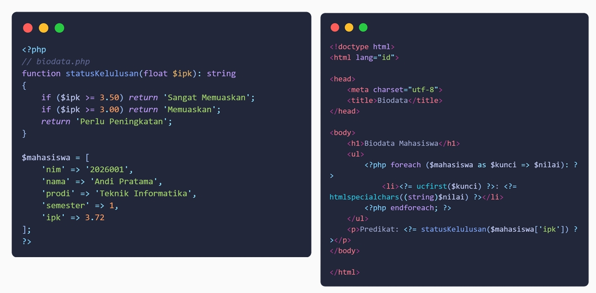
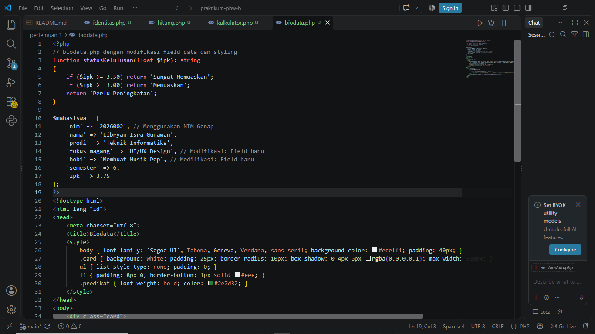
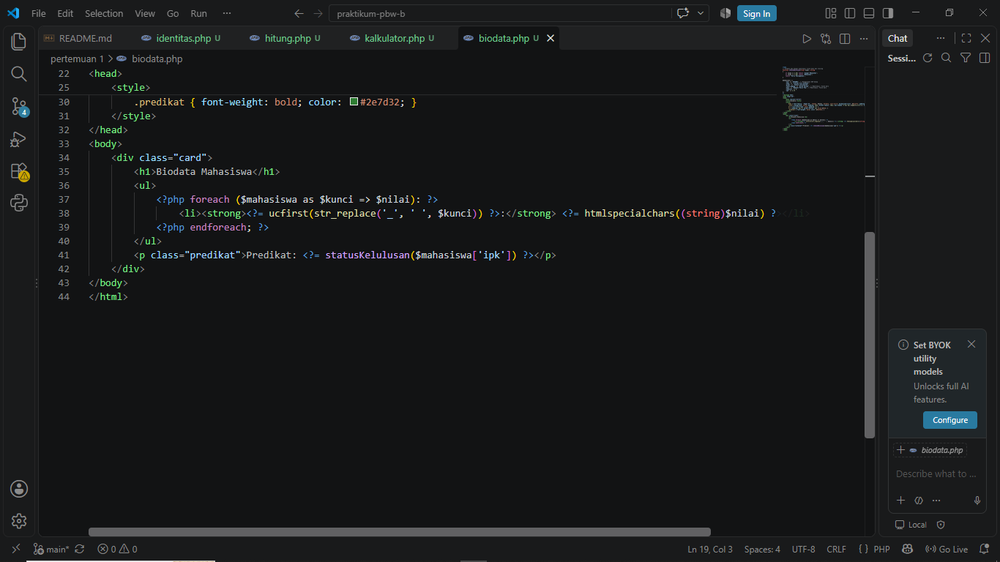
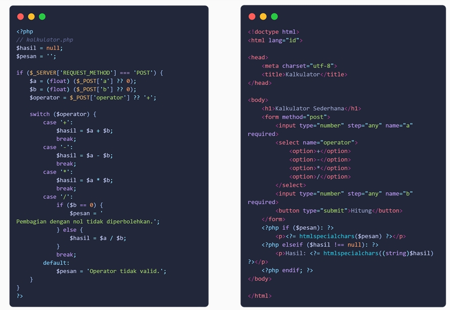
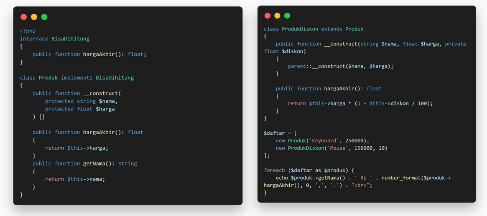
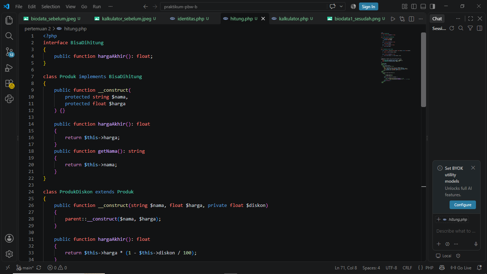
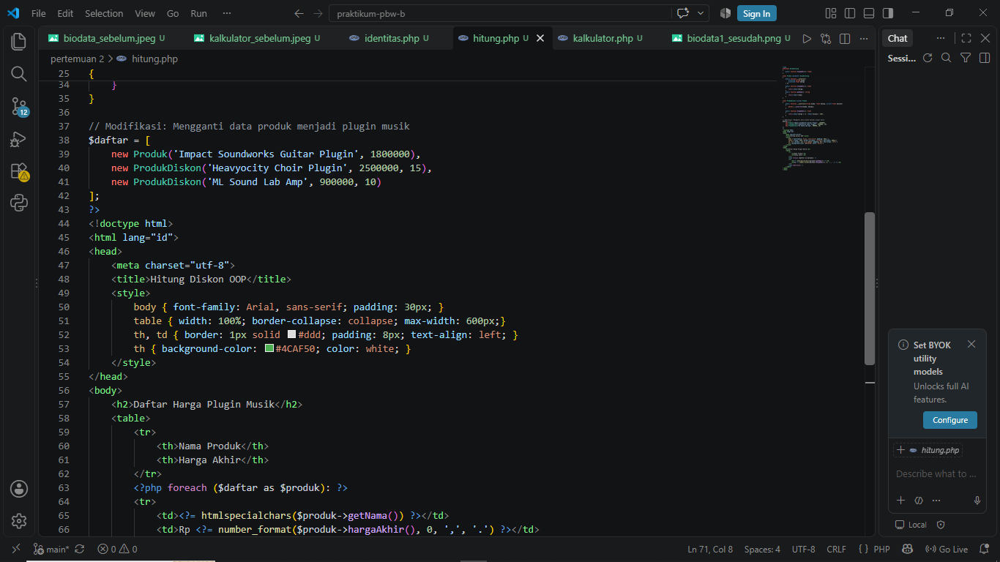
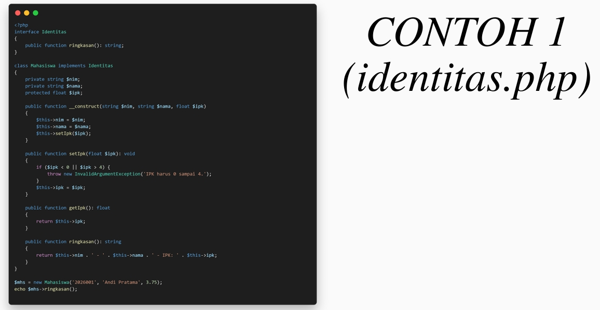
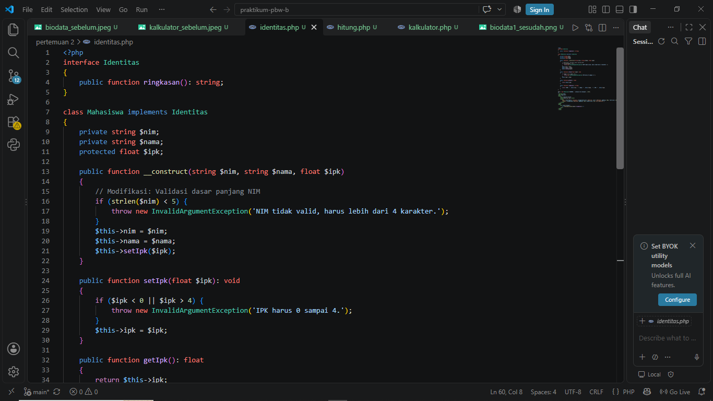
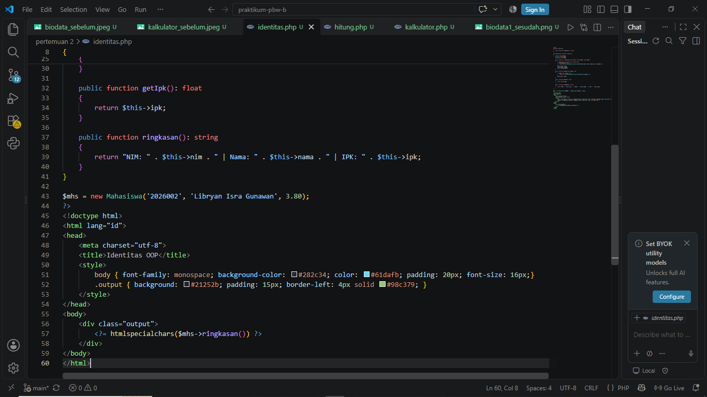

# praktikum-pbw-b
Repository untuk Tugas Praktikum PBW
# Tugas Praktikum Pemrograman Berbasis Web (PBW)

## Tugas 1 (Pertemuan 1)

### 5 Bagian Kode Penting:
1. `$_SERVER['REQUEST_METHOD'] === 'POST'`: Mengecek apakah form telah disubmit menggunakan metode POST sebelum memproses data hitungan.
2. `switch ($operator)`: Struktur kontrol yang mengevaluasi nilai operator matematika dan menjalankan blok kode yang sesuai (tambah, kurang, bagi, kali, atau modulus).
3. `htmlspecialchars()`: Fungsi keamanan penting untuk mencegah serangan XSS dengan mengubah karakter khusus HTML menjadi entitas HTML.
4. `foreach ($mahasiswa as $kunci => $nilai)`: Perulangan yang digunakan untuk menampilkan setiap key dan value dari array assosiatif biodata secara dinamis.
5. `function statusKelulusan(float $ipk): string`: Deklarasi fungsi dengan *type hinting* yang memastikan parameter input berupa angka desimal (float) dan wajib mengembalikan teks (string).

### 1 Error, Penyebab, dan Langkah Perbaikan:
* **Error:** `DivisionByZeroError` saat membagi angka dengan nol.
* **Penyebab:** Secara matematis angka tidak bisa dibagi nol, dan PHP akan menghasilkan error fatal jika operasi ini diteruskan tanpa pengecekan.
* **Langkah Perbaikan:** Menambahkan kondisi `if ($b == 0)` sebelum operasi pembagian atau modulus dieksekusi, lalu menampilkan pesan peringatan khusus ke layar.

### Screenshot Hasil Modifikasi
**Sebelum Modifikasi:**

**Sesudah Modifikasi:**

**Sebelum Modifikasi:**

**Sesudah Modifikasi:**

---

## Tugas 2 (Pertemuan 2)

### 5 Bagian Kode Penting:
1. `interface BisaDihitung`: Mendefinisikan kerangka standar (kontrak) bahwa setiap kelas yang mengimplementasikannya wajib memiliki metode `hargaAkhir()`.
2. `class ProdukDiskon extends Produk`: Menerapkan konsep *Inheritance* (pewarisan), di mana `ProdukDiskon` mewarisi properti dan metode dari *class parent* `Produk`.
3. `parent::__construct($nama, $harga)`: Memanggil konstruktor dari kelas induk (`Produk`) agar tidak perlu menulis ulang inisialisasi properti `$nama` dan `$harga` di kelas anak.
4. `protected string $nama`: Modifier akses `protected` memungkinkan properti ini diakses oleh kelas itu sendiri dan kelas turunannya, namun tidak bisa diakses langsung dari luar objek.
5. `throw new InvalidArgumentException()`: Cara standar untuk menangani dan melemparkan peringatan error ketika parameter yang diinputkan pengguna tidak lolos validasi (misalnya IPK di luar batas 0-4).

### 1 Error, Penyebab, dan Langkah Perbaikan:
* **Error:** `Uncaught InvalidArgumentException: IPK harus 0 sampai 4.`
* **Penyebab:** Terjadi saat menginisialisasi objek `Mahasiswa` baru, nilai parameter IPK yang dimasukkan melebihi rentang valid (misal: 4.5).
* **Langkah Perbaikan:** Pastikan nilai float yang dipassing pada saat memanggil `new Mahasiswa()` berada di rentang 0 hingga 4. Error handling ini sengaja dibuat agar objek selalu memiliki data yang valid.

### Screenshot Hasil Modifikasi
**Sebelum Modifikasi:**

**Sesudah Modifikasi:**

**Sebelum Modifikasi:**

**Sesudah Modifikasi:**

